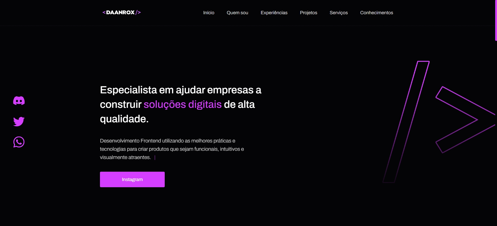

# Portfólio - Daanrox

## Descrição 
Este repositório armazena o código fonte do meu portfólio online, composto por cinco seções:
- **Home:** Apresentação inicial do site;
- **Quem sou:** Descrição sobre minha trajetória e experiência;
- **Experiências:** Destaque das empresas em que atuei na área de desenvolvimento e design;
- **Projetos:** Apresentação de alguns projetos desenvolvidos, com links para os códigos no GitHub;
- **Serviços:** Exibição, por meio de cards, dos diferentes serviços em que possuo conhecimento;
- **Conhecimentos:** Apresentação das minhas habilidades em linguagens, com foco no front-end.

### Deploy
Aplicação em produção: [https://www.daanrox.com/](https://www.daanrox.com/)

## Tecnologias Utilizadas
- HTML
- CSS
- Javascript
- SCSS
- ScrollReveal
- SVG Inject

## Contato
Se tiver dúvidas ou precisar de mais informações, sinta-se à vontade para entrar em contato:
- Email : [contato@daanrox.com](mailto:contato@daanrox.com)
- LinkedIn: [https://www.linkedin.com/in/daanrox/](Daanrox)

--- 

"Consagre ao Senhor tudo o que você faz, e os seus planos serão bem-sucedidos."
